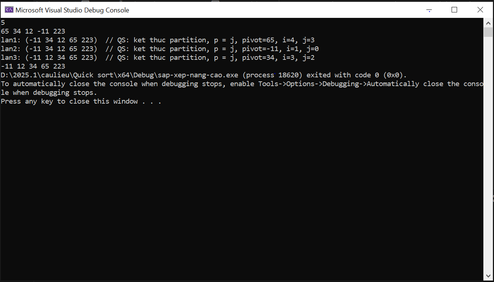
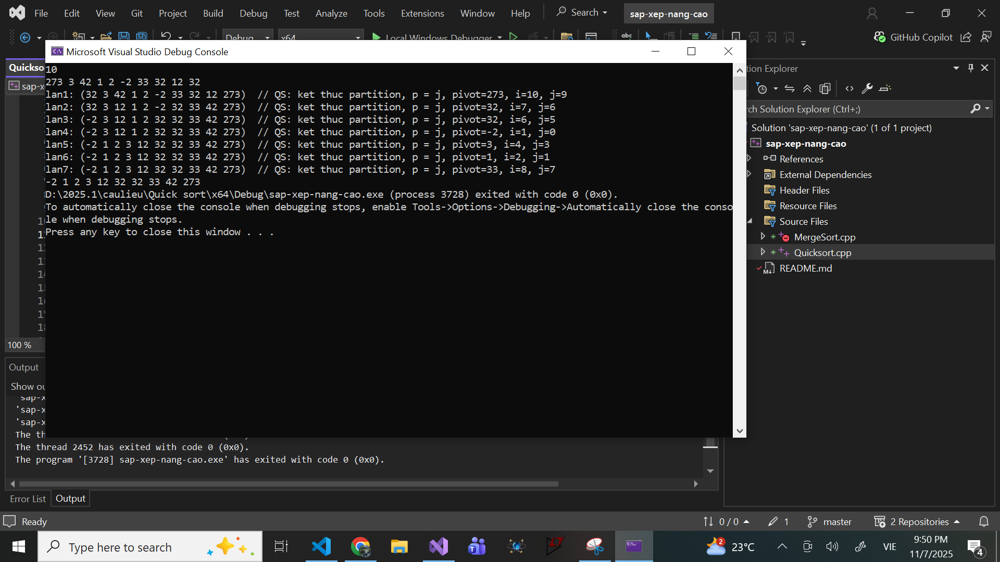
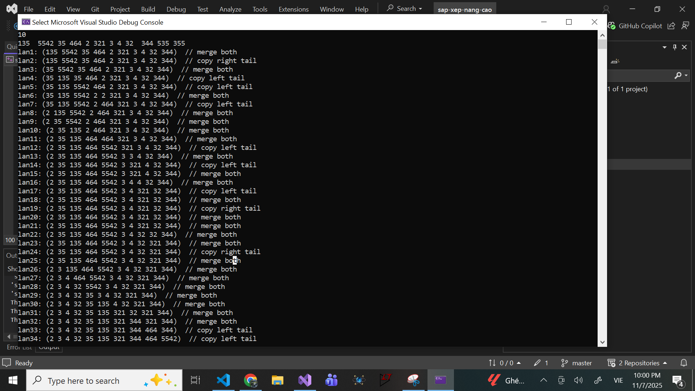

# Bài 6: Các giải thuật sắp xếp nâng cao
## Nguyễn Công Đông - 20233318
### 1.Quick Sort
 - Chương trình này được thực hiện trên Visual Studio 2022. Chương trình sắp xếp dãy số nguyên bất kỳ theo thứ tự tăng dần và in ra trạng thái mảng theo từng vòng lặp
 - Độ phức tạp của thuật toán O(nlogn) (Độ phức tạp của thuật toán sắp xếp). thực tế với bài này khi phải in ra trạng thái mảng theo từng vòng lặp nên độ phức tạp sẽ là O(n^2).
> Các bộ test với thuật toán:
- Đầu tiên nhấn f5 để chạy chương trình.  tại màn hình khởi chạy ta nhập: số nguyên dương (n > 0) sau đó **Enter**. Vì giới hạn của chương trình này, nếu nhập n = số âm hoặc n = các ký tự không phải số nguyên dương, chương trình sẽ bị dừng hoặc chạy sai, sai thì phải làm lại từ đầu. Sau khi nhập xong n và xuống dòng, ta sẽ nhập các giá trị của phần tử trong mảng vừa nhập số lương phần tử bằng n, nhập các phần từ cách nhau bằng dấu **Space** hoặc dấu **Enter**.
- TH1: n = 5 và a[] = { 65, 34, 12, -11, 223}. 
Đây là kết quả khởi chạy:

Vòng lặp được thực hiện 3 lần, chốt và giá trị của i, j qua từng vòng lặp đã được hiển thị ở trên màn hình.
- Th2: n = 10 và a[].
Đây là kết quả khởi chạy:

### 2. Marge sort
- Chương trình này được thực hiện trên Visual Studio 2022. Chương trình sắp xếp dãy số nguyên bất kỳ theo thứ tự tăng dần và in ra trạng thái mảng theo từng vòng lặp.
- Độ phức tạp của thuật toán O(nlogn) (Độ phức tạp của thuật toán sắp xếp). thực tế với bài này khi phải in ra trạng thái mảng theo từng vòng lặp nên độ phức tạp sẽ là O(n^2).
> Các bộ test với thuật toán:
- Đầu tiên nhấn f5 để chạy chương trình.  tại màn hình khởi chạy ta nhập: số nguyên dương (n > 0) sau đó **Enter**. Vì giới hạn của chương trình này, nếu nhập n = số âm hoặc n = các ký tự không phải số nguyên dương, chương trình sẽ bị dừng hoặc chạy sai, sai thì phải làm lại từ đầu. Sau khi nhập xong n và xuống dòng, ta sẽ nhập các giá trị của phần tử trong mảng vừa nhập số lương phần tử bằng n, nhập các phần từ cách nhau bằng dấu **Space** hoặc dấu **Enter**.
- TH1: n = 5 và a[]
Đây là kết quả khởi chạy: 
.
- TH2: n = 10 và a[]
Đây là kết quả khởi chạy:
 (34 lần in)

